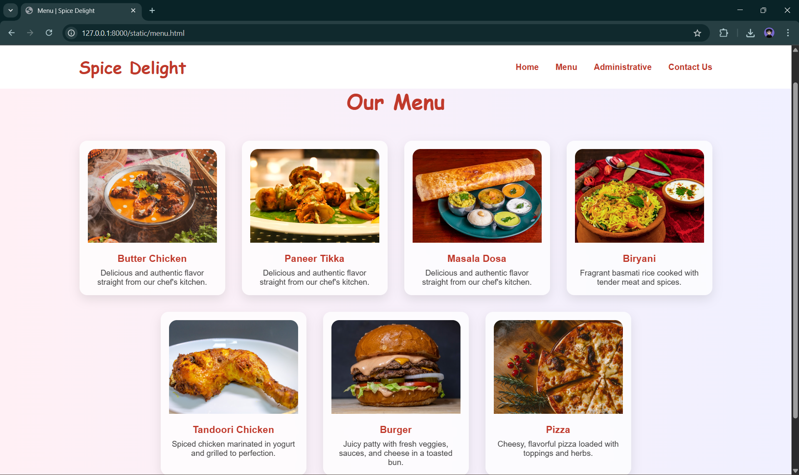

# Ex.07 Restaurant Website
## Date:13-05-2025

## AIM:
To develop a static Restaurant website to display the food items and services provided by them.

## DESIGN STEPS:

### Step 1:
Requirement collection.

### Step 2:
Creating the layout using HTML and CSS.

### Step 3:
Updating the sample content.

### Step 4:
Choose the appropriate style and color scheme.

### Step 5:
Validate the layout in various browsers.

### Step 6:
Validate the HTML code.

### Step 7:
Publish the website in the given URL.

## PROGRAM:
home.html
```
<html lang="en">
<head>
  <meta charset="UTF-8" />
  <meta name="viewport" content="width=device-width, initial-scale=1.0" />
  <title>TastyBites - Home</title>
  <link rel="stylesheet" href="style.css" />
</head>
<body>
  <header>
    <h1>TastyBites</h1>
    <nav>
      <a href="index.html">Home</a>
      <a href="menu.html">Menu</a>
      <a href="admin.html">Administration</a>
      <a href="contact.html">Contact Us</a>
    </nav>
  </header>

  <main>
    <section class="banner">
      <h2>Welcome to TastyBites!</h2>
      <p>Delicious food served fresh every day.</p>
    </section>

    <section class="intro">
      <h3>Why Choose Us?</h3>
      <p>At TastyBites, we bring you the finest dishes with the freshest ingredients. Experience great taste and hospitality like never before!</p>
    </section>

    <!-- New Gallery Section -->
    <section class="gallery">
      <h3>Our Ambiance</h3>
      <div class="gallery-grid">
        <div></div>
        <div></div>
        <div></div>
        <div></div>
      </div>
    </section>
  </main>

  <footer>
    © 2025 Gokul Nath
  </footer>
</body>
</html>
```
menu.html
```
<html lang="en">
<head>
  <meta charset="UTF-8" />
  <meta name="viewport" content="width=device-width, initial-scale=1.0" />
  <title>TastyBites - Menu</title>
  <link rel="stylesheet" href="style.css" />
</head>
<body>
  <header>
    <h1>TastyBites</h1>
    <nav>
      <a href="index.html">Home</a>
      <a href="menu.html">Menu</a>
      <a href="admin.html">Administration</a>
      <a href="contact.html">Contact Us</a>
    </nav>
  </header>

  <main>
    <h2>Our Menu</h2>
    <div class="menu-grid">
      <div class="item"><p>Burger - $5</p></div>
      <div class="item"><p>Pizza - $8</p></div>
      <div class="item"><p>Pasta - $7</p></div>
      <div class="item"><p>Salad - $4</p></div>
      <div class="item"><p>Fries - $3</p></div>
      <div class="item"><p>Sandwich - $6</p></div>
      <div class="item"><p>Steak - $12</p></div>
      <div class="item"><p>Soup - $4</p></div>
      <div class="item"><p>Dosa - $5</p></div>
      <div class="item"><p>Ice Cream - $3</p></div>
      <div class="item"><p>Noodles - $6</p></div>
      <div class="item"><p>Biryani - $10</p></div>
    </div>
  </main>

  <footer>
    © 2025 Gokul Nath
  </footer>
</body>
</html>
```
admin.html
```
<html lang="en">
<head>
  <meta charset="UTF-8" />
  <meta name="viewport" content="width=device-width, initial-scale=1.0" />
  <title>TastyBites - Administration</title>
  <link rel="stylesheet" href="style.css" />
</head>
<body>
  <header>
    <h1>TastyBites</h1>
    <nav>
      <a href="index.html">Home</a>
      <a href="menu.html">Menu</a>
      <a href="admin.html">Administration</a>
      <a href="contact.html">Contact Us</a>
    </nav>
  </header>

  <main>
    <h2>Our Administration</h2>
    <div class="admin-grid">
      <div class="admin"><p>John - Manager</p></div>
      <div class="admin"><p>Mary - Head Chef</p></div>
      <div class="admin"><p>David - Assistant Chef</p></div>
      <div class="admin"><p>Sarah - Receptionist</p></div>
      <div class="admin"><p>Leo - Supervisor</p></div>
      <div class="admin"><p>Dev - Marketing Head</p></div>
    </div>
  </main>

  <footer>
    © 2025 Gokul Nath
  </footer>
</body>
</html>
```
contact.html
```
<html lang="en">
<head>
  <meta charset="UTF-8" />
  <meta name="viewport" content="width=device-width, initial-scale=1.0" />
  <title>TastyBites - Contact Us</title>
  <link rel="stylesheet" href="style.css" />
</head>
<body>
  <header>
    <h1>TastyBites</h1>
    <nav>
      <a href="index.html">Home</a>
      <a href="menu.html">Menu</a>
      <a href="admin.html">Administration</a>
      <a href="contact.html">Contact Us</a>
    </nav>
  </header>

  <main>
    <h2>Contact Us</h2>
    <p>📍 123 Food Street, Tindivanam, Tamil Nadu</p>
    <p>📞 +91 98765 43210</p>
    <p>✉️ tastybites@email.com</p>
  </main>

  <footer>
    © 2025 Gokul Nath
  </footer>
</body>
</html>
```
## OUTPUT:




## RESULT:
The program for designing software company website using HTML and CSS is completed successfully.
