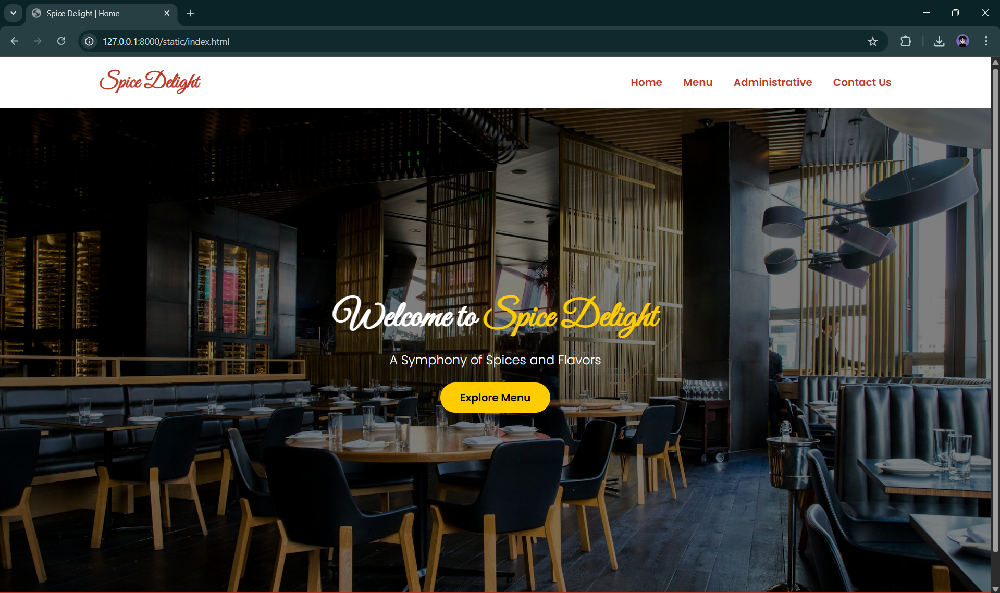

# Ex.07 Restaurant Website
## Date:13-05-2025

## AIM:
To develop a static Restaurant website to display the food items and services provided by them.

## DESIGN STEPS:

### Step 1:
Requirement collection.

### Step 2:
Creating the layout using HTML and CSS.

### Step 3:
Updating the sample content.

### Step 4:
Choose the appropriate style and color scheme.

### Step 5:
Validate the layout in various browsers.

### Step 6:
Validate the HTML code.

### Step 7:
Publish the website in the given URL.

## PROGRAM:
home.html
```
<!DOCTYPE html>
<html lang="en">
<head>
  <meta charset="UTF-8" />
  <title>Spice Delight | Home</title>
  <link rel="stylesheet" href="style.css" />
  <link href="https://fonts.googleapis.com/css2?family=Great+Vibes&family=Poppins:wght@300;600&display=swap" rel="stylesheet">
</head>
<body>
  <header>
    <nav>
      <h1>Spice Delight</h1>
      <ul>
        <li><a href="index.html">Home</a></li>
        <li><a href="menu.html">Menu</a></li>
        <li><a href="admin.html">Administrative</a></li>
        <li><a href="contact.html">Contact Us</a></li>
      </ul>
    </nav>
  </header>

  <section class="hero">
    <div class="hero-text">
      <h2>Welcome to <span>Spice Delight</span></h2>
      <p>A Symphony of Spices and Flavors</p>
      <a href="menu.html" class="button">Explore Menu</a>
    </div>
  </section>
  <footer>
    <p>&copy; 2025 Spice Delight. All rights reserved.</p>
  </footer>
</body>
</html>

```
menu.html
```
<!DOCTYPE html>
<html lang="en">
<head>
  <meta charset="UTF-8" />
  <title>Menu | Spice Delight</title>
  <link rel="stylesheet" href="style.css" />
</head>
<body>
  <div class="container">
    <header>
      <nav>
        <h1>Spice Delight</h1>
        <ul>
          <li><a href="index.html">Home</a></li>
          <li><a href="menu.html">Menu</a></li>
          <li><a href="admin.html">Administrative</a></li>
          <li><a href="contact.html">Contact Us</a></li>
        </ul>
      </nav>
    </header>

    <section class="menu-section">
      <h2>Our Menu</h2>
      <div class="menu-cards">
        <div class="card">
          
          <h3>Butter Chicken</h3>
          <p>Delicious and authentic flavor straight from our chef's kitchen.</p>
        </div>

        <div class="card">
          
          <h3>Paneer Tikka</h3>
          <p>Delicious and authentic flavor straight from our chef's kitchen.</p>
        </div>

        <div class="card">
          
          <h3>Masala Dosa</h3>
          <p>Delicious and authentic flavor straight from our chef's kitchen.</p>
        </div>

        <div class="card">
          
          <h3>Biryani</h3>
          <p>Fragrant basmati rice cooked with tender meat and spices.</p>
        </div>

        <div class="card">
          
          <h3>Tandoori Chicken</h3>
          <p>Spiced chicken marinated in yogurt and grilled to perfection.</p>
        </div>

        <div class="card">
          
          <h3>Burger</h3>
          <p>Juicy patty with fresh veggies, sauces, and cheese in a toasted bun.</p>
        </div>

        <div class="card">
          
          <h3>Pizza</h3>
          <p>Cheesy, flavorful pizza loaded with toppings and herbs.</p>
        </div>
      </div>
    </section>

    <footer>
      <p>&copy; 2025 Spice Delight. All rights reserved.</p>
    </footer>
  </div>
</body>
</html>
```
admin.html
```
<!DOCTYPE html>
<html lang="en">
<head>
  <meta charset="UTF-8" />
  <title>Administrative | Spice Delight</title>
  <link rel="stylesheet" href="style.css" />
</head>
<body>
  <header>
    <nav>
      <h1>Spice Delight</h1>
      <ul>
        <li><a href="index.html">Home</a></li>
        <li><a href="menu.html">Menu</a></li>
        <li><a href="admin.html">Administrative</a></li>
        <li><a href="contact.html">Contact Us</a></li>
      </ul>
    </nav>
  </header>

  <section class="highlight">
    <h3>Our Administrative Team</h3>
    <div class="cards">
      <div class="card">
        
        <h4>Operations Manager</h4>
        <p>Ensures the restaurant runs smoothly and efficiently.</p>
      </div>
      <div class="card">
        
        <h4>Head Chef</h4>
        <p>Leads the kitchen team and creates our signature dishes.</p>
      </div>
      <div class="card">
         
        <h4>Customer Relations</h4>
        <p>Maintains satisfaction and handles feedback with care.</p>
      </div>
    </div>
  </section>

  <footer>
    <p>&copy; 2025 Spice Delight. All rights reserved.</p>
  </footer>
</body>
</html>

```
contact.html
```
<!DOCTYPE html>
<html lang="en">
<head>
  <meta charset="UTF-8" />
  <title>Contact Us | Spice Delight</title>
  <link rel="stylesheet" href="style.css" />
</head>
<body>
  <header>
    <nav>
      <h1>Spice Delight</h1>
      <ul>
        <li><a href="index.html">Home</a></li>
        <li><a href="menu.html">Menu</a></li>
        <li><a href="admin.html">Administrative</a></li>
        <li><a href="contact.html">Contact Us</a></li>
      </ul>
    </nav>
  </header>

  <section class="highlight">
    <h3>Contact Us</h3>
    <div class="cards">
      <div class="card">
        <h4>Phone</h4>
        <p>+91 98765 43210</p>
      </div>
      <div class="card">
        <h4>Email</h4>
        <p>spicedelight@example.com</p>
      </div>
      <div class="card">
        <h4>Visit Us</h4>
        <p>123 Spice Street, Chennai, Tamil Nadu</p>
      </div>
    </div>

    <div class="feedback-form">
      <h3>We’d Love Your Feedback</h3>
      <form action="#" method="POST">
        <input type="text" name="name" placeholder="Your Name" required />
        <input type="email" name="email" placeholder="Your Email" required />
        <textarea name="message" rows="5" placeholder="Your Feedback" required></textarea>
        <button type="submit">Submit Feedback</button>
      </form>
    </div>
  </section>

  <footer>
    <p>&copy; 2025 Spice Delight. All rights reserved.</p>
  </footer>
</body>
</html>

```
## OUTPUT:



## RESULT:
The program for designing software company website using HTML and CSS is completed successfully.
